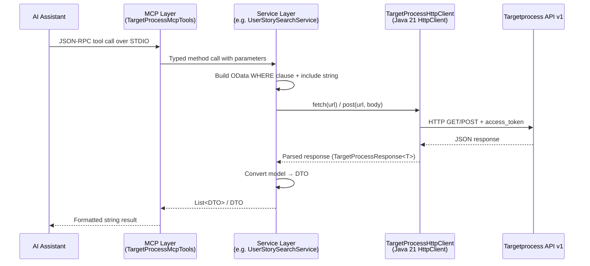
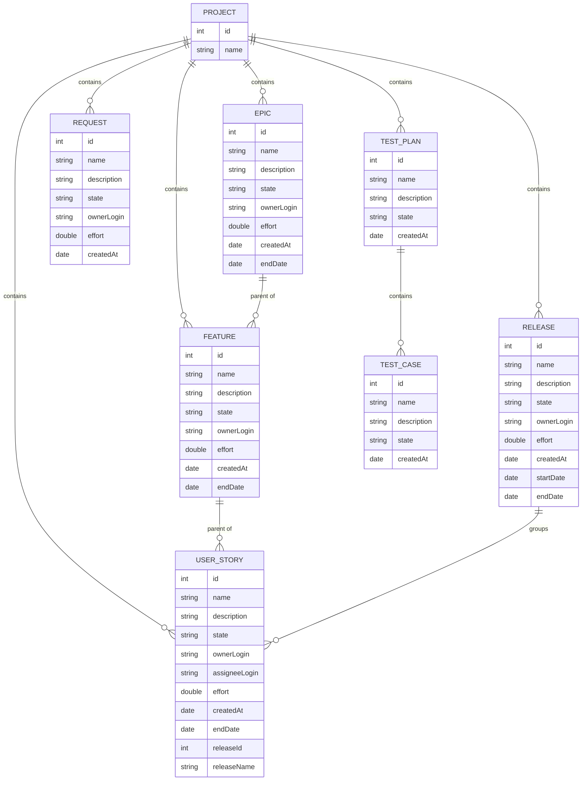

# Targetprocess MCP Server

A Spring Boot application implementing the [Model Context Protocol (MCP)](https://modelcontextprotocol.io) to expose IBM Targetprocess data to AI assistants.

## Table of Contents

- [Prerequisites](#prerequisites)
- [Configuration](#configuration)
- [Build & Run](#build--run)
- [Architecture](#architecture)
- [Data Model](#data-model)
- [Available Tools](#available-tools)
- [Integration](#integration)

---

## Prerequisites

- Java 21+
- Gradle (wrapper included)
- A Targetprocess API Access Token (Profile → Settings → API Access Tokens)

---

## Configuration

Set the following environment variables:

| Variable | Example |
| --- | --- |
| `TARGETPROCESS_BASE_URL` | `https://youraccount.tpondemand.com` |
| `TARGETPROCESS_ACCESS_TOKEN` | Your generated API token |

---

## Build & Run

```bash
# Build fat JAR
./gradlew build --no-daemon

# Run tests
./gradlew test

# Start server (waits for MCP JSON-RPC on stdin)
java -jar build/libs/targetprocess-mcp-0.0.1-SNAPSHOT.jar
```

> The server uses STDIO transport — all logs go to **stderr** so stdout stays clean for MCP communication.

---

## Architecture

### Request flow



### Package structure

```
com.ibm.mcp.targetprocess/
├── config/               TargetProcessConfig, TargetProcessProperties
├── shared/
│   ├── client/           TargetProcessHttpClient
│   ├── exception/        TargetProcessApiException, TargetProcessClientException
│   └── model/            Project, Owner, EntityState, ReleaseReference, TargetProcessResponse
├── userstory/            model / dto / converter / service / controller
├── epic/                 model / dto / converter / service / controller
├── feature/              model / dto / converter / service / controller
├── release/              model / dto / converter / service / controller
├── request/              model / dto / converter / service / controller
├── testplan/             model / dto / converter / service / controller
├── testcase/             model / dto / converter / service / controller
└── project/              model / dto / converter / service / controller
```

Each domain package follows the same layered pattern:

```
Tool (@Tool)  →  *SearchService / *CreateService / *UpdateService / *GetByIdService  →  *Converter  →  TargetProcessHttpClient
```

---

## Data Model

The diagram below shows the entities exposed by this server and their relationships within Targetprocess.



---

## Available Tools

| Tool | Entity | Description | Key parameters |
| --- | --- | --- | --- |
| `searchUserStories` | User Story | Search with filters, ordered by creation date desc | `nameQuery`, `projectName`, `creatorLogin`, `startDate`, `endDate`, `take`, `releaseId` |
| `createUserStory` | User Story | Create a new user story | `name`*, `projectId`*, `description`, `effort` |
| `updateUserStory` | User Story | Update fields by ID (only non-blank fields are changed) | `id`*, `name`, `description`, `stateName`, `effort` |
| `getUserStoryById` | User Story | Fetch full details including description | `id`* |
| `searchEpics` | Epic | Search with filters, ordered by creation date desc | `nameQuery`, `projectName`, `ownerLogin`, `startDate`, `endDate`, `take` |
| `createEpic` | Epic | Create a new epic | `name`*, `projectId`*, `description`, `effort` |
| `updateEpic` | Epic | Update fields by ID | `id`*, `name`, `description`, `stateName`, `effort` |
| `getEpicById` | Epic | Fetch full details including description | `id`* |
| `searchFeatures` | Feature | Search with filters, ordered by creation date desc | `nameQuery`, `projectName`, `ownerLogin`, `startDate`, `endDate`, `take` |
| `createFeature` | Feature | Create a new feature | `name`*, `projectId`*, `description`, `effort` |
| `updateFeature` | Feature | Update fields by ID | `id`*, `name`, `description`, `stateName`, `effort` |
| `getFeatureById` | Feature | Fetch full details including description | `id`* |
| `searchReleases` | Release | Search with filters, ordered by creation date desc | `nameQuery`, `projectName`, `ownerLogin`, `startDate`, `endDate`, `take` |
| `createRelease` | Release | Create a new release | `name`*, `projectId`*, `description`, `effort` |
| `updateRelease` | Release | Update fields by ID | `id`*, `name`, `description`, `stateName`, `effort` |
| `getReleaseById` | Release | Fetch full details including description | `id`* |
| `searchRequests` | Request | Search with filters, ordered by creation date desc | `nameQuery`, `projectName`, `ownerLogin`, `startDate`, `endDate`, `take` |
| `createRequest` | Request | Create a new request | `name`*, `projectId`*, `description`, `effort` |
| `updateRequest` | Request | Update fields by ID | `id`*, `name`, `description`, `stateName`, `effort` |
| `getRequestById` | Request | Fetch full details including description | `id`* |
| `searchTestPlans` | Test Plan | Search with filters, ordered by creation date desc | `nameQuery`, `projectName`, `ownerLogin`, `startDate`, `endDate`, `take` |
| `createTestPlan` | Test Plan | Create a new test plan | `name`*, `projectId`*, `description` |
| `updateTestPlan` | Test Plan | Update fields by ID | `id`*, `name`, `description`, `stateName` |
| `getTestPlanById` | Test Plan | Fetch full details including description | `id`* |
| `searchTestCases` | Test Case | Search with filters, ordered by creation date desc | `nameQuery`, `projectName`, `ownerLogin`, `startDate`, `endDate`, `take` |
| `createTestCase` | Test Case | Create a new test case | `name`*, `projectId`*, `description`, `testPlanId` |
| `updateTestCase` | Test Case | Update fields by ID | `id`*, `name`, `description`, `stateName` |
| `getTestCaseById` | Test Case | Fetch full details including description | `id`* |
| `searchProjects` | Project | Search projects by name | `nameQuery`, `startDate`, `endDate`, `take` |

`*` required parameter

> **Description format:** always use HTML (`<h2>`, `<p>`, `<ul>`, `<li>`, `<strong>`), never plain markdown. To embed a Mermaid diagram, base64-encode the definition and use `" />`.

---

## Integration

### Claude Code CLI

```bash
claude mcp add targetprocess -- java -jar "/path/to/targetprocess-mcp/build/libs/targetprocess-mcp-0.0.1-SNAPSHOT.jar"
```

Or add manually to `~/.claude.json`:

```json
{
  "mcpServers": {
    "targetprocess": {
      "command": "java",
      "args": ["-jar", "/path/to/targetprocess-mcp/build/libs/targetprocess-mcp-0.0.1-SNAPSHOT.jar"],
      "env": {
        "TARGETPROCESS_BASE_URL": "https://youraccount.tpondemand.com",
        "TARGETPROCESS_ACCESS_TOKEN": "your_api_token"
      }
    }
  }
}
```

### Claude Desktop

Add to `claude_desktop_config.json`:

```json
{
  "mcpServers": {
    "targetprocess": {
      "command": "java",
      "args": ["-jar", "/path/to/targetprocess-mcp/build/libs/targetprocess-mcp-0.0.1-SNAPSHOT.jar"],
      "env": {
        "TARGETPROCESS_BASE_URL": "https://youraccount.tpondemand.com",
        "TARGETPROCESS_ACCESS_TOKEN": "your_api_token"
      }
    }
  }
}
```
